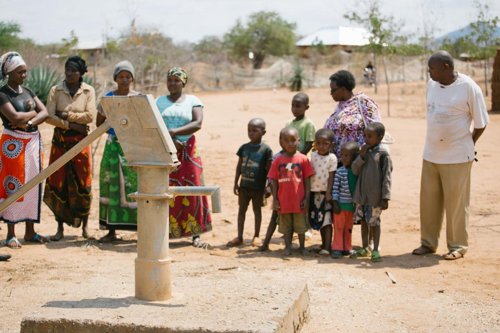
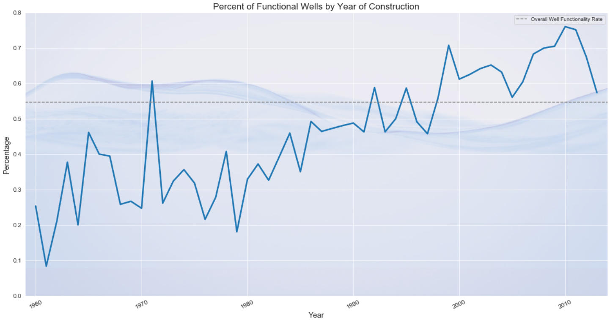
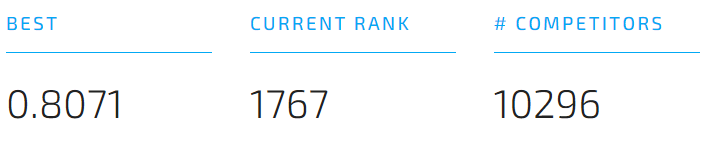
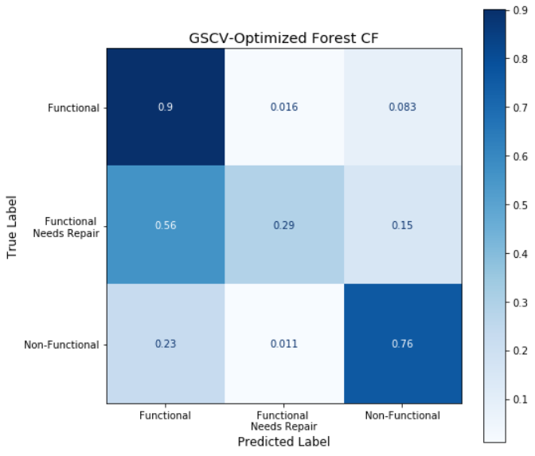

# Pump It Up: Data Mining the Water Table

#### Repo Contents:
- a folder containing data used in the project
- a folder containing relevant images
- an EDA notebook containing some visualizations and exploration
- a model notebook explaining our model and going over various iterations
- a functions file containing custom functions and imports used in both notebooks
- a slide deck presentation of the findings

This repo contains work for the Pump It Up data science competition. The competition website can be found [here](https://www.drivendata.org/competitions/7/pump-it-up-data-mining-the-water-table/page/23/).

The overall aim of the project is to use ML to predict the operational status of wells in Tanzania. These wells fell into three categories: functional, functional but in need of repair, and non-functional. 

We used an OSEMN approach to handle this task.

### Obtain & Scrub
The data was available for download from the competition website. Looking it over, we discovered several null values, redundant columns, and placeholder values. These we dealt with in ways appropriate for each category. For example. for 0s in the 'construction_year' category, we imputed random years based on the existing spread of years.

### Explore
Here we examined the connection between various features and the functionality of the wells. We built a helper function to visualize the percent of working wells in each category and went through each category looking for those that could help classify the data. Some visualizations and details of this process can be found in the EDA notebook; one example is provided below.

### Model
We built a Random Forest model and used a grid search to tweak hyperparameters. Our final model was reasonably accurate. Results were confirmed with a confusion matrix. Overall, it was the repairable wells that were hardest to classify. This is likely due in part to a class imbalance, but SMOTE was not able to correct the problem and indeed made our model worse. 

Upon submission, this was our highest score:

### Interpret
The most important features for our model were the geographic features, especially latitude, longitude, and gps_height. Other relevant strong features were waterpoint type and extraction method. 

As this confusion matrix shows, we were better at predicting functional wells than non-functional. This could reflect a slight bias in the data - slightly more wells were functional than non-functional. 

Overall, our model got the following score in the competition:

## Future Work
- try to find features that uniquely identify the wells in need of repair, since those should be our top priorities
- work to chart out the most water-starved regions. Many broken wells exist adjacent to functioning wells; when it comes to actually improving people's lives, fixing those wells is not as important as focusing on areas where there are fewer functioning wells per person.
- deal more thoroughly with data cleaning:
    - impute missing long/lat data by using data from villages, basins, etc.
    - create more macro-categories for funders, schemes, and other features with too many categories
- work on model-stacking to combine several models and hopefully increase accuracy
    - this could be exceptionally useful if we did KNN on the geographic data, for example.